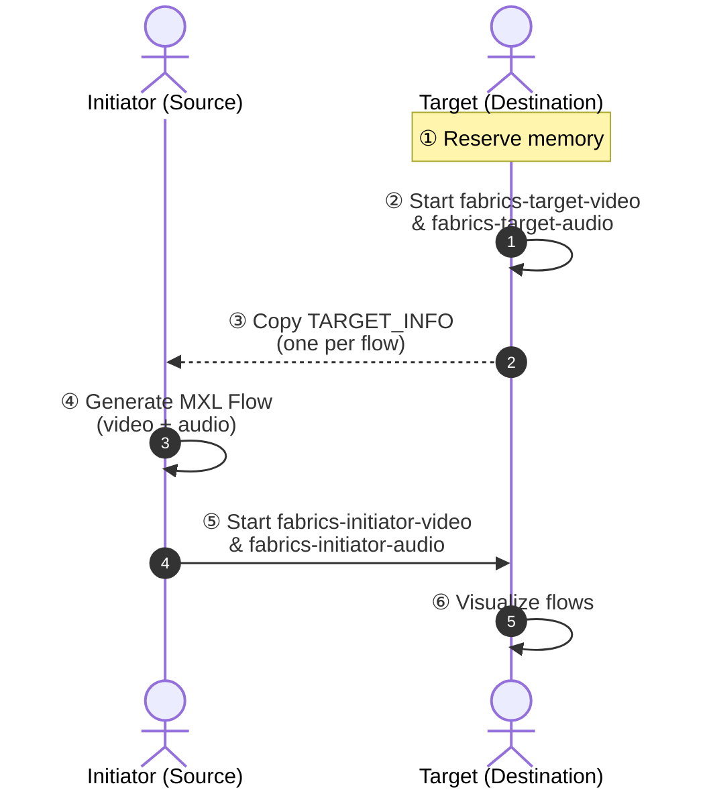

# MXL Fabrics Demo — TL;DR Quick Reference

## Flow Diagram



---

## Setup (both hosts)

Set RoCE traffic class (TC 3 / DSCP 24):

```bash
echo 96 | sudo tee /sys/kernel/config/rdma_cm/rocep152s0f0/ports/1/default_roce_tos
sudo ip link set enp152s0f0np0 down && sudo ip link set enp152s0f0np0 up
```

---

## ② Target (start first)

Start video and audio targets (each listens on its own port):

```bash
docker compose -f docker-compose-fabrics.yaml up fabrics-target-video fabrics-target-audio
```

→ Copy `TARGET_INFO` from each service's output (one per flow).

```bash
./scripts/bind-compose-domain.sh /dev/shm/mxl
```

Optional — visualise:

```bash
docker compose -f docker-compose-tools.yaml up
echo '{"id":"51ef9b5c-98c1-4f98-9def-1d61ee9a4fdb"}' > /dev/shm/mxl/domain_def.json
```

---

## ④ Initiator — generate flow

```bash
docker compose -f docker-compose-tools.yaml up
./scripts/bind-compose-domain.sh /dev/shm/mxl
echo '{"id":"61ef9b5c-98c1-4f98-9def-1d61ee9a4fdb"}' > /dev/shm/mxl/domain_def.json
```

Start clip player at `http://<HOST_IP>:9602/` **or** use test source:

```bash
docker compose up video-flow-writer
```

---

## ⑤ Initiator — send to target

Video:

```bash
TARGET_INFO="<paste video target-info>" docker compose -f docker-compose-fabrics.yaml up fabrics-initiator-video
```

Audio:

```bash
TARGET_INFO="<paste audio target-info>" docker compose -f docker-compose-fabrics.yaml up fabrics-initiator-audio
```

---

## Teardown (reverse order, both hosts)

```bash
# 1. Stop tools
docker compose -f docker-compose-tools.yaml down

# 2. Stop fabrics (initiator first, then target)
docker compose -f docker-compose-fabrics.yaml down

# 3. Release bind mount
sudo umount /dev/shm/mxl && sudo rmdir /dev/shm/mxl

# 4. Remove domain volume
docker volume rm mxl-example_mxl-domain
```

---

## Verify clean state

```bash
docker ps -a --filter "name=mxl-example"
docker volume ls --filter "name=mxl-example_mxl-domain"
mount | grep /dev/shm/mxl
```

All should return empty.
