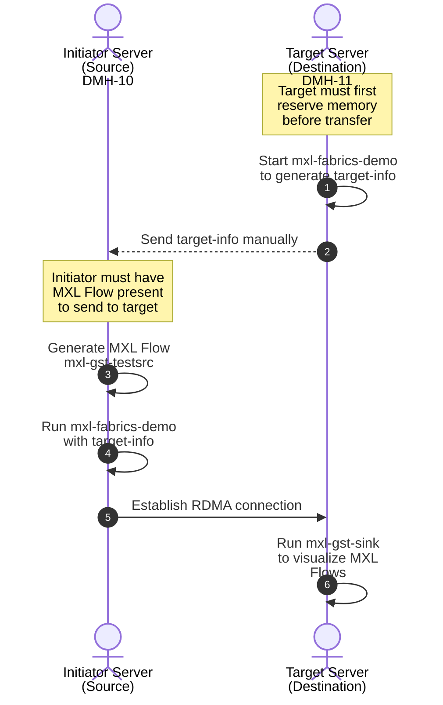

# MXL Fabrics example

This walkthrough shows how to move an MXL video flow between two servers over RDMA (RoCEv2) using the `mxl-fabrics-demo` tool. One host acts as the **Target** (receiver, which reserves memory for the incoming flow) and the other as the **Initiator** (sender, which has a live MXL flow and pushes it into the target's memory). The supporting `docker-compose-tools.yaml` stack provides a clip player and visualisers so the transfer can be seen on screen.

## Flow diagram



## Server setup

Configure the RoCE traffic class (DSCP) on both RDMA servers. Toggling these values during the demo lets the audience watch the traffic class change live on Arista CloudVision.

Set TC 3 (DSCP 24, ToS byte `0x60` = 96) — the lossless class typically reserved for storage/RDMA:

```
echo 96 | sudo tee /sys/kernel/config/rdma_cm/rocep152s0f0/ports/1/default_roce_tos
```

Set TC 0 (best-effort) — useful for showing the contrast against TC 3:

```
echo 0 | sudo tee /sys/kernel/config/rdma_cm/rocep152s0f0/ports/1/default_roce_tos
```

The RoCE stack only reads `default_roce_tos` when the interface comes up, so bounce the link after every change:

```
sudo ip link set enp152s0f0np0 down && sudo ip link set enp152s0f0np0 up
```

## Target -- Destination

The Target must be started first: it allocates the receive memory region and prints a `TARGET_INFO` blob that the Initiator needs in order to connect.

1. Start the fabrics target. It will block, holding the RDMA listener open, and print the `TARGET_INFO` JSON to stdout:

    ```
    docker compose -f docker-compose-fabrics.yaml up fabrics-target
    ```

1. Copy the `TARGET_INFO` line from the logs — it has to be hand-carried to the Initiator (out of band, e.g. chat or SSH).

1. Bind-mount the MXL domain volume to `/dev/shm/mxl` so host tools (and the next step's `echo`) can see the same domain the container sees. The helper script resolves the Docker volume mountpoint and `mount --bind`s it:

    ```
    ./scripts/bind-compose-domain.sh /dev/shm/mxl
    ```

1. OPTIONAL: Start the MXL-Tools stack to visualise the received flow (clip player, `mxl-info-gui`, MediaMTX/WebRTC bridge). The `domain_def.json` write registers the domain UUID the tools expect:

    ```
    docker compose -f docker-compose-tools.yaml up
    echo '{"id":"51ef9b5c-98c1-4f98-9def-1d61ee9a4fdb"}' > /dev/shm/mxl/domain_def.json
    ```

## Initiator -- Source

The Initiator needs an existing MXL flow in its local domain before it can push anything to the Target. The tools stack provides that flow via the clip player.

1. Start MXL-Tools and bind-mount the domain so the clip player and host shell share the same `/dev/shm/mxl`:

    ```
    docker compose -f docker-compose-tools.yaml up
    ./scripts/bind-compose-domain.sh /dev/shm/mxl
    echo '{"id":"61ef9b5c-98c1-4f98-9def-1d61ee9a4fdb"}' > /dev/shm/mxl/domain_def.json
    ```

    Note the domain ID differs from the Target's on purpose — each host runs its own MXL domain; the fabric is what bridges them.

1. Open the clip player at `http://<HOST_IP_ADDRESS>:9602/` and start a clip. This populates flow `5fbec3b1-1b0f-417d-9059-8b94a47197ed` in the local domain, which is the flow the initiator container is hard-coded to send.

    If you don't want to run the full MXL-Tools stack, you can instead generate the flow directly from the base compose file using `mxl-gst-testsrc`:

    ```
    docker compose up video-flow-writer
    ```

    This writes the same `5fbec3b1-…` test video flow into `mxl-example_mxl-domain`, so the initiator step below works unchanged.

1. Start `mxl-fabrics-demo` in initiator mode, passing the `TARGET_INFO` captured earlier. The container will open the RDMA connection and begin writing frames into the Target's memory:

    ```
    TARGET_INFO="{{ PASTE_TARGET_INFO_HERE }}" docker compose -f docker-compose-fabrics.yaml up fabrics-initiator
    ```

## Demo teardown

Tear down in the reverse order of setup, on **both** the Initiator and the Target. The MXL domain volume (`mxl-example_mxl-domain`) is a `tmpfs` that backs the live-video ring buffers — it must be removed at the end so no stale flow state or residual frames are reused on the next run.

1. Stop the visualisation / clip player stack on both hosts. `Ctrl+C` in the compose window is fine, then bring the stack down to remove the containers:

    ```
    docker compose -f docker-compose-tools.yaml down
    ```

1. Stop the fabrics containers. Bring the **Initiator** down first so the sender tears down the RDMA queue pairs cleanly; the Target will then exit on its own:

    ```
    docker compose -f docker-compose-fabrics.yaml down
    ```

1. Release the bind mount created by `bind-compose-domain.sh`. The script `mount --bind`s the Docker volume's mountpoint onto `/dev/shm/mxl`, and Docker will refuse to delete the volume while that bind is still active:

    ```
    sudo umount /dev/shm/mxl
    sudo rmdir /dev/shm/mxl
    ```

    If the mountpoint is still present or `rmdir` reports "Device or resource busy", use this recovery sequence (it handles repeated/stacked mounts):

    ```
    while sudo findmnt -n /dev/shm/mxl >/dev/null; do
        sudo umount /dev/shm/mxl || sudo umount -l /dev/shm/mxl
    done
    sudo rmdir /dev/shm/mxl
    ```

    If needed, identify lingering users with:

    ```
    sudo lsof +D /dev/shm/mxl
    sudo fuser -vm /dev/shm/mxl
    ```

1. Delete the MXL domain volume to wipe the ring buffers and `domain_def.json`. Run on both hosts:

    ```
    docker volume rm mxl-example_mxl-domain
    ```

    Both compose files declare the same named volume, so a single `docker volume rm` per host clears everything. Alternatively, pass `-v` to each `docker compose down` above to remove the volume in the same step.

1. (Optional) Reset the RoCE traffic class to the default so the NIC is left in a known state for the next rehearsal:

    ```
    echo 0 | sudo tee /sys/kernel/config/rdma_cm/rocep152s0f0/ports/1/default_roce_tos
    sudo ip link set enp152s0f0np0 down && sudo ip link set enp152s0f0np0 up
    ```

1. (Optional) Confirm nothing is left behind:

    ```
    docker ps -a --filter "name=mxl-example"
    docker volume ls --filter "name=mxl-example_mxl-domain"
    mount | grep /dev/shm/mxl
    ```

    All three should return empty.
